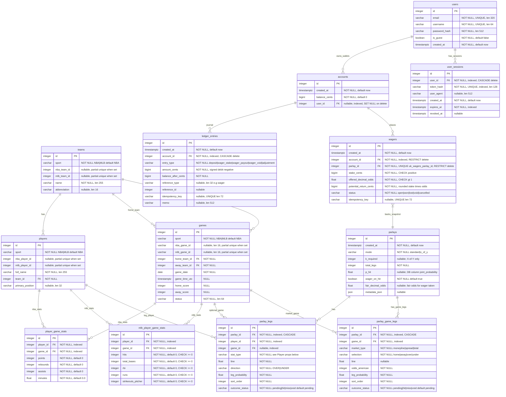

# Database schema

PostgreSQL tables shared across sports. Each sport-scoped row carries a `sport`
column (`NBA` or `MLB`) and exactly one native external ID (`nba_*` or `mlb_*`).



## Sport scoping

| Table   | Constraint |
|---------|------------|
| `teams` | `sport = 'NBA'` requires `nba_team_id` and forbids `mlb_team_id`; `sport = 'MLB'` is the mirror. |
| `players` | Same pattern with `nba_player_id` / `mlb_player_id`. |
| `games` | Same pattern with `nba_game_id` / `mlb_game_id`. |

Box-score stats are split by sport:

- **NBA** — `player_game_stats` (`points`, `rebounds`, `assists`, `minutes`)
- **MLB** — `mlb_player_game_stats` (`hits`, `total_bases`, `rbi`, `runs`, `strikeouts_pitcher`)

Settlement reads the appropriate table based on `games.sport`.

## Player props

### `parlay_legs` encoding

Both sports persist player-prop legs in `parlay_legs`. The `stat_type`, `line`, and
`direction` columns are interpreted by the sport of the referenced `game_id`.

| Sport | `stat_type` values | Market shape |
|-------|-------------------|--------------|
| NBA | `PTS`, `REB`, `AST` | Single half-point over/under line (e.g. `24.5` OVER / UNDER) |
| MLB | `HITS`, `TOTAL_BASES`, `RBI`, `RUNS`, `STRIKEOUTS_PITCHER` | **Milestone ladder** — see below |

MLB milestone picks are stored as **`direction = OVER`** with **`line = threshold − 0.5`**
so existing settlement (`actual > line`) grades “N or more” correctly:

| User-facing pick | `line` | `direction` | Grades as |
|------------------|--------|-------------|-----------|
| 1+ hits | `0.5` | `OVER` | `hits >= 1` |
| 2+ hits | `1.5` | `OVER` | `hits >= 2` |
| 3+ hits | `2.5` | `OVER` | `hits >= 3` |

The `UNDER` direction remains valid in the schema but is not offered in the MLB UI;
NBA continues to use both sides.

### MLB prop API (`GET /mlb/games/{id}/props`)

Not stored in the database — computed at request time from rolling
`mlb_player_game_stats` — but returned as:

```
MLBGamePropLinesBundle
├── game: MLBGameRead
├── lookback_days: int
├── min_samples: int
└── players: MLBPlayerPropLinesRead[]
    ├── id, full_name, team_id, team_name, …
    ├── sample_size: int
    └── stat_lines: MLBPropStatLineRead[]
        ├── stat_type: HITS | TOTAL_BASES | RBI | RUNS | STRIKEOUTS_PITCHER
        └── thresholds: MLBPropThresholdRead[]   # always 1+, 2+, 3+ when offered
            ├── threshold: 1 | 2 | 3
            ├── line: 0.5 | 1.5 | 2.5          # wager-leg encoding
            ├── american: string                 # price for "N+" (yes)
            └── under_american: string           # complementary no side (pricer only)
```

**Pricing model**

Each milestone’s fair probability is `P(X ≥ threshold)` for a Poisson distribution
whose rate λ is the player’s rolling per-game average of that stat. The house margin
is applied to the two-way (reaches / does-not-reach) market per milestone. The pricer
selects the milestone matching the client’s `line`, de-vigs `american` / `under_american`,
and applies the ticket-level margin once at parlay aggregation
