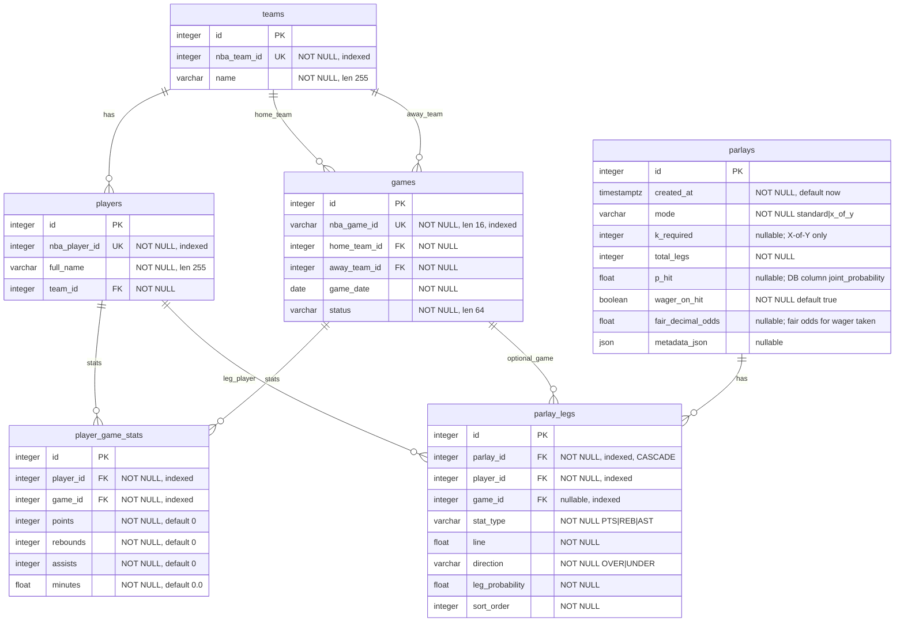

# Database schema

This diagram matches the models under `backend/app/db/models/`

## Notes

- `games` references `teams` twice: `home_team_id` and `away_team_id` are separate foreign keys to `teams.id`.
- `player_game_stats` has btree indexes on `player_id` and `game_id`, and a **unique constraint** on `(player_id, game_id)`.
- NBA identifiers (`nba_team_id`, `nba_player_id`, `nba_game_id`) support idempotent ingestion from `nba_api`.
- **`parlays` / `parlay_legs`** are application-defined (not filled by NBA ingestion). Enum-like columns use **VARCHAR** (`native_enum=False`). Check constraints: `x_of_y` requires valid `k_required`; `standard` keeps `k_required` null.
- **`p_hit`** is always **P(parlay hits)** (physical column name remains **`joint_probability`** in Postgres for older DBs). **`wager_on_hit`** selects for vs against; **`fair_decimal_odds`** is **1 / P(ticket wins)** (anti uses **1 − p_hit** for the ticket).
- `parlay_legs.game_id` is optional so legs can target a player without a scheduled row yet.
- Unique `(parlay_id, sort_order)` on `parlay_legs`.

