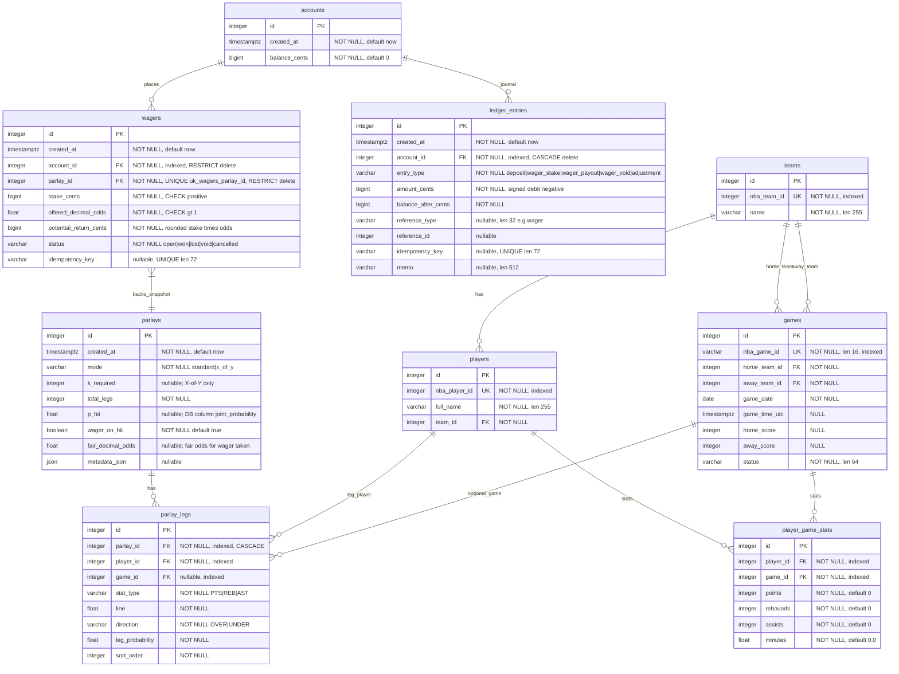

# Database schema

This diagram matches the models under `backend/app/db/models/`

## Notes

- `games` references `teams` twice: `home_team_id` and `away_team_id` are separate foreign keys to `teams.id`.
- `player_game_stats` has btree indexes on `player_id` and `game_id`, and a **unique constraint** on `(player_id, game_id)`.
- NBA identifiers (`nba_team_id`, `nba_player_id`, `nba_game_id`) support idempotent ingestion from `nba_api`.
- **`parlays` / `parlay_legs`** are application-defined (not filled by NBA ingestion). Enum-like columns use **VARCHAR** (`native_enum=False`). Check constraints: `x_of_y` requires valid `k_required`; `standard` keeps `k_required` null.
- **`p_hit`** is always **P(parlay hits)** (physical column name remains **`joint_probability`** in Postgres for older DBs). **`wager_on_hit`** selects for vs against; **`fair_decimal_odds`** is **1 / P(ticket wins)** (anti uses **1 − p_hit** for the ticket).
- `parlay_legs.game_id` is optional so legs can target a player without a scheduled row yet.
- Unique `(parlay_id, sort_order)` on `parlay_legs`.

### Money (accounts / ledger / wagers)

- **`accounts`** holds a cached **`balance_cents`** (bigint). Application code adjusts it **only** in the same DB transaction as an appended **`ledger_entries`** row; negative **`amount_cents`** are debits, positive credits.
- **`ledger_entries.reference_type`** / **`reference_id`** link postings to domain rows (e.g. **`wager`** + wager id). Optional **`idempotency_key`** is globally **UNIQUE** for safe **`POST`** replay (especially deposits).
- Composite index **`ix_ledger_entries_account_created`** on **`(account_id, created_at)`** supports recent-history queries by account.
- **`wagers`** is the financed ticket at a **priced** payout multiple: **`offered_decimal_odds`** and **`potential_return_cents`** (typically `round(stake_cents × odds)`). Exactly **one wager per parlay** is enforced by **`uq_wagers_parlay_id`**; **`parlays` rows created via `POST /parlays` alone have no wager. **`ON DELETE RESTRICT`** on **`wagers`** → **`parlays`** avoids deleting math snapshots while money rows exist (settlement workflows should flip **`status`** instead of hard-deleting **`parlays`**).
- **`Wager.status`** lifecycle **`open`** → **`won` / `lost` / `void` / `cancelled`** is reserved for grading/cashout logic; extra ledger types (**`wager_payout`**, **`wager_void`**, **`adjustment`**) exist for future settlement.
- **`wagers.idempotency_key`** is optional and **UNIQUE** for idempotent wager placement (**`POST /accounts/{id}/wagers`**).

