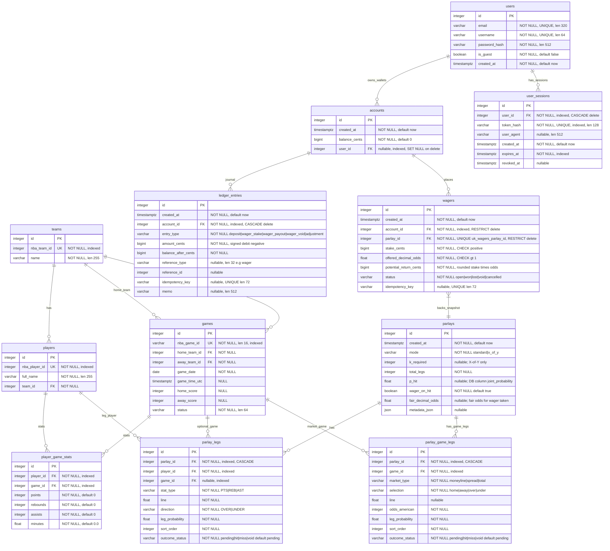

# Database schema

```mermaid
erDiagram
    teams {
        integer id PK
        integer nba_team_id UK "NOT NULL, indexed"
        varchar name "NOT NULL, len 255"
    }

    players {
        integer id PK
        integer nba_player_id UK "NOT NULL, indexed"
        varchar full_name "NOT NULL, len 255"
        integer team_id FK "NOT NULL"
    }

    games {
        integer id PK
        varchar nba_game_id UK "NOT NULL, len 16, indexed"
        integer home_team_id FK "NOT NULL"
        integer away_team_id FK "NOT NULL"
        date game_date "NOT NULL"
        timestamptz game_time_utc "NULL"
        integer home_score "NULL"
        integer away_score "NULL"
        varchar status "NOT NULL, len 64"
    }

    player_game_stats {
        integer id PK
        integer player_id FK "NOT NULL, indexed"
        integer game_id FK "NOT NULL, indexed"
        integer points "NOT NULL, default 0"
        integer rebounds "NOT NULL, default 0"
        integer assists "NOT NULL, default 0"
        float minutes "NOT NULL, default 0.0"
    }

    accounts {
        integer id PK
        timestamptz created_at "NOT NULL, default now"
        bigint balance_cents "NOT NULL, default 0"
        integer user_id FK "nullable, indexed, SET NULL on delete"
    }

    users {
        integer id PK
        varchar email "NOT NULL, UNIQUE, len 320"
        varchar username "NOT NULL, UNIQUE, len 64"
        varchar password_hash "NOT NULL, len 512"
        boolean is_guest "NOT NULL, default false"
        timestamptz created_at "NOT NULL, default now"
    }

    user_sessions {
        integer id PK
        integer user_id FK "NOT NULL, indexed, CASCADE delete"
        varchar token_hash "NOT NULL, UNIQUE, indexed, len 128"
        varchar user_agent "nullable, len 512"
        timestamptz created_at "NOT NULL, default now"
        timestamptz expires_at "NOT NULL, indexed"
        timestamptz revoked_at "nullable"
    }

    ledger_entries {
        integer id PK
        timestamptz created_at "NOT NULL, default now"
        integer account_id FK "NOT NULL, indexed, CASCADE delete"
        varchar entry_type "NOT NULL deposit|wager_stake|wager_payout|wager_void|adjustment"
        bigint amount_cents "NOT NULL, signed debit negative"
        bigint balance_after_cents "NOT NULL"
        varchar reference_type "nullable, len 32 e.g wager"
        integer reference_id "nullable"
        varchar idempotency_key "nullable, UNIQUE len 72"
        varchar memo "nullable, len 512"
    }

    parlays {
        integer id PK
        timestamptz created_at "NOT NULL, default now"
        varchar mode "NOT NULL standard|x_of_y"
        integer k_required "nullable; X-of-Y only"
        integer total_legs "NOT NULL"
        float p_hit "nullable; DB column joint_probability"
        boolean wager_on_hit "NOT NULL default true"
        float fair_decimal_odds "nullable; fair odds for wager taken"
        json metadata_json "nullable"
    }

    wagers {
        integer id PK
        timestamptz created_at "NOT NULL, default now"
        integer account_id FK "NOT NULL, indexed, RESTRICT delete"
        integer parlay_id FK "NOT NULL, UNIQUE uk_wagers_parlay_id, RESTRICT delete"
        bigint stake_cents "NOT NULL, CHECK positive"
        float offered_decimal_odds "NOT NULL, CHECK gt 1"
        bigint potential_return_cents "NOT NULL, rounded stake times odds"
        varchar status "NOT NULL open|won|lost|void|cancelled"
        varchar idempotency_key "nullable, UNIQUE len 72"
    }

    parlay_legs {
        integer id PK
        integer parlay_id FK "NOT NULL, indexed, CASCADE"
        integer player_id FK "NOT NULL, indexed"
        integer game_id FK "nullable, indexed"
        varchar stat_type "NOT NULL PTS|REB|AST"
        float line "NOT NULL"
        varchar direction "NOT NULL OVER|UNDER"
        float leg_probability "NOT NULL"
        integer sort_order "NOT NULL"
        varchar outcome_status "NOT NULL pending|hit|miss|void default pending"
    }

    parlay_game_legs {
        integer id PK
        integer parlay_id FK "NOT NULL, indexed, CASCADE"
        integer game_id FK "NOT NULL, indexed"
        varchar market_type "NOT NULL moneyline|spread|total"
        varchar selection "NOT NULL home|away|over|under"
        float line "nullable"
        integer odds_american "NOT NULL"
        float leg_probability "NOT NULL"
        integer sort_order "NOT NULL"
        varchar outcome_status "NOT NULL pending|hit|miss|void default pending"
    }

    teams ||--o{ players : "has"
    teams ||--o{ games : "home_team"
    teams ||--o{ games : "away_team"
    players ||--o{ player_game_stats : "stats"
    games ||--o{ player_game_stats : "stats"
    users ||--o{ accounts : "owns_wallets"
    users ||--o{ user_sessions : "has_sessions"
    accounts ||--o{ ledger_entries : "journal"
    accounts ||--o{ wagers : "places"
    wagers }|--|| parlays : "backs_snapshot"
    parlays ||--o{ parlay_legs : "has"
    parlays ||--o{ parlay_game_legs : "has_game_legs"
    players ||--o{ parlay_legs : "leg_player"
    games ||--o{ parlay_legs : "optional_game"
    games ||--o{ parlay_game_legs : "market_game"
```

